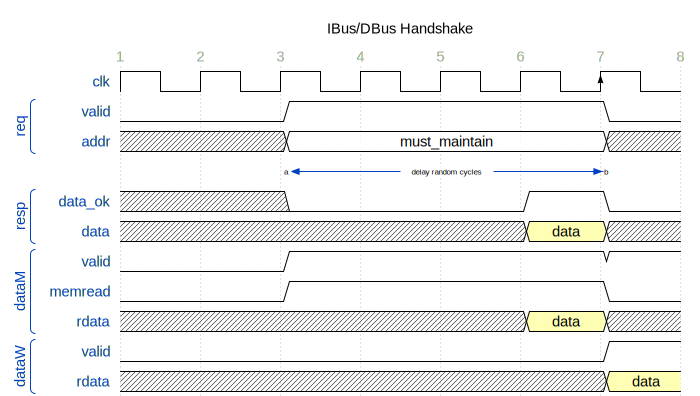

# 总线（上）

为了适配内存的不确定延迟，需要带握手信号的总线。

> 访存延迟：发起访存请求（包括指令读、内存读写）后，不能在同一周期得到结果，且不知道多少个周期后能得到结果。


## 1 握手总线

回顾 IBus 和 DBus 的信号：

```verilog
 typedef struct packed {
     logic    valid;   // in request?
     addr_t   addr;    // target address
     // ...
 } dbus_req_t;
 
 typedef struct packed {
     logic  addr_ok;
     logic  data_ok;  // is the field "data" valid?
     word_t data;     // the data read from cache
 } dbus_resp_t;
```


我们在 response 里加了一个 `data_ok` 信号用于标识访存操作在这一时钟周期完成。

该总线的协议包括：

* `req.valid` 为0时，`resp.data_ok` 为不定值。
* `req.valid` 为1期间，代表一次访存请求。在此期间，`req.valid` 与 `req.addr` 不允许改变。
* `req.valid` 为1时，检查`resp.data_ok`。如果为1，则下个时钟的上升沿表示一次**握手**，本次访存结束。如果握手后 `req.valid` 仍为1，则视为新的一次请求。



访存的延迟，要求流水线的控制信号做出一定的改变。用 `req.valid && ~resp.data_ok` 表示一次未完成的访存请求，流水线需要阻塞。

```verilog
assign stallM = dreq.valid && ~dresp.data_ok;
assign flushW = dreq.valid && ~dresp.data_ok;

// in memory stage
assign dataM.mem_rdata = dresp.data;
```

## 2 仲裁

新增限制：CPU 与内存之间只有一个访存端口。当 ireq 与 dreq 同时有效时，仲裁器需要屏蔽一个 req。

`vsrc/util/CBusArbiter.sv` 里已实现了一个简单的仲裁器。

