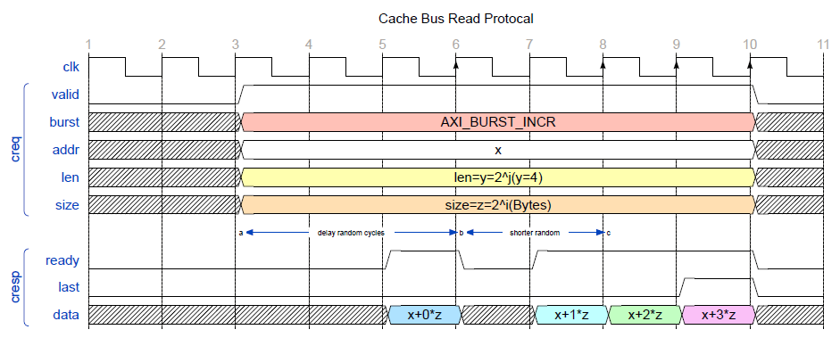
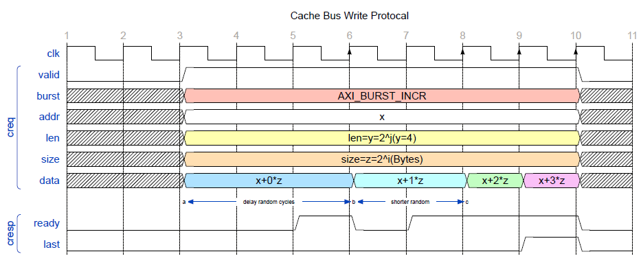

# 总线（下）

内存每次寻址的延迟很大，但一次寻址得到的数据块通常远大于总线宽度。

引入突发传输的机制，在一次访存事务中传输连续的多个字。

缓存总线（Cache Bus, CBus）借鉴了 `AXI4`，用于支持突发传输。

```verilog
 typedef struct packed {
     logic    valid;     // in request?
     logic    is_write;  // is it a write transaction?
     msize_t  size;      // number of bytes in one burst
     addr_t   addr;      // start address
     strobe_t strobe;    // which bytes are enabled?
     word_t   data;      // the data to write
     mlen_t   len;       // number of bursts
	 axi_burst_type_t burst;
 } cbus_req_t;
 
 typedef struct packed {
     logic  ready;  // is data arrived in this cycle?
     logic  last;   // is it the last word?
     word_t data;   // the data from AXI bus
 } cbus_resp_t;
```

CBus 有三个用于突发传输的请求信号：

* size 表示一个字的大小，需要小于等于总线宽度
* len 表示这次突发传输中字的数量
* burst 表示突发传输的模式，比如 `AXI_BURST_FIXED`，`AXI_BURST_INCR` 
  * `AXI_BURST_FIXED` 表示不使用突发传输，len 也为 `MLEN1`
  * `AXI_BURST_INCR` 表示使用递增式突发传输，传输 `addr`，`addr + size`，`addr + (len - 1) * size`位置的字。


CBus 中有两个握手信号 `ready` 和 `last`，分别表示一个字和整个事务的握手。

读请求：


写请求：
